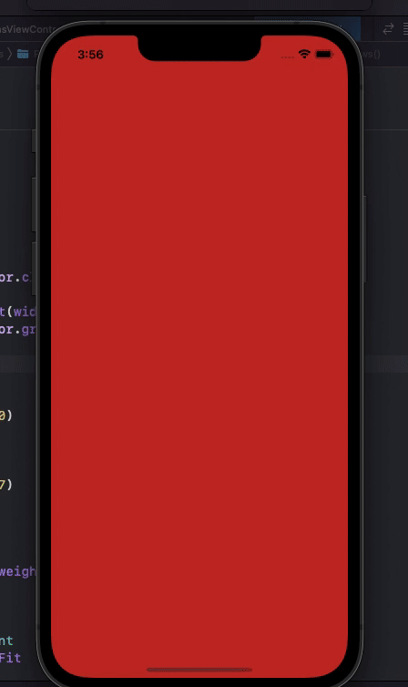
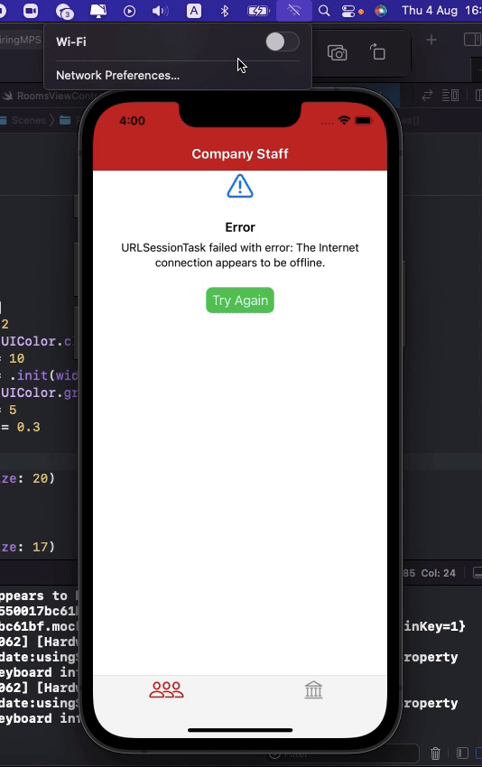
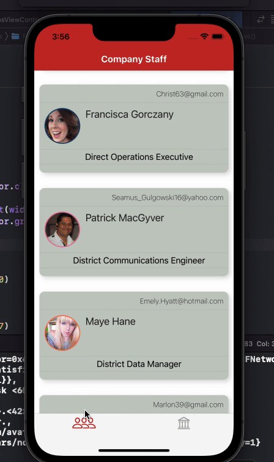
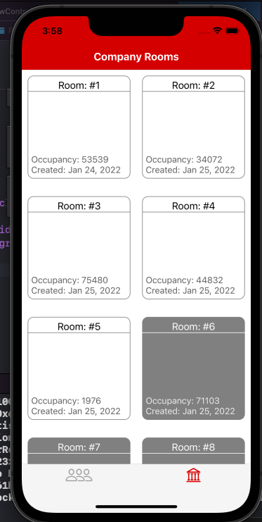

# HiringMPS
Test project for MPS

Due to tight deadlines, many of the terms of reference did not have time to do or check.
In carrying out the task, the main efforts were applied to the design of the architecture and the creation of a maintainable and extensible architecture.

**Project architecture:**\
Used a modular architecture based on SPM. The application is divided into modules. Each module only knows about the modules it needs. The presentation layer uses an MVVM architecture with reactive bindings using RxSwift. It was customary to use RxSwift, since the task stipulates support for iOS 11.
An entity such as Coordinator is responsible for navigation in the application.
The main target of the application only knows about Coordinators, DependencyResolver, Assemblies modules. This is enough to start the application.

**For testing:**\
Launched the application only on iOS 15 device.
How it works on other systems I can not say for sure.
But modules can very well be covered by tests, since each module is independent of other modules. The project uses DI for dependency injection.

**Dependency Management.**\
As a dependency management - Swiftjen is used, which is wrapped in wrapper. Therefore, it will never be a problem to replace the DI client.

**UI layout:**\
SnapKit is used as a tool for building the UI. Storyboard and xib are not used in the project.

**networking:**\
RxAlamofire reactive wrapper used

**Resources:**\
All application resources (fonts, images, localized strings, colors) should be in the AppDesign module. I did not have time to transfer everything to this module.
Also, to generate resources, you must use auto-generating frameworks.

S**upport for iPhone and iPad:**
There is partial support for iPhone and iPad

